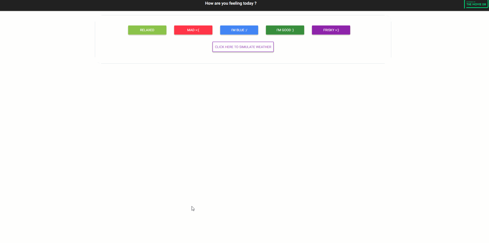

# Movie-App

An application that allows the user to find a movie taking into account the weather and well-being resulting from a short survey. The work was done during studies for presentation on the diploma defense.

## Used technologies

* Bootstrap
* Geolocation API
* The Movie Database API
* Free Code Camp Weather API

 ## Usage
 
 

 
 

